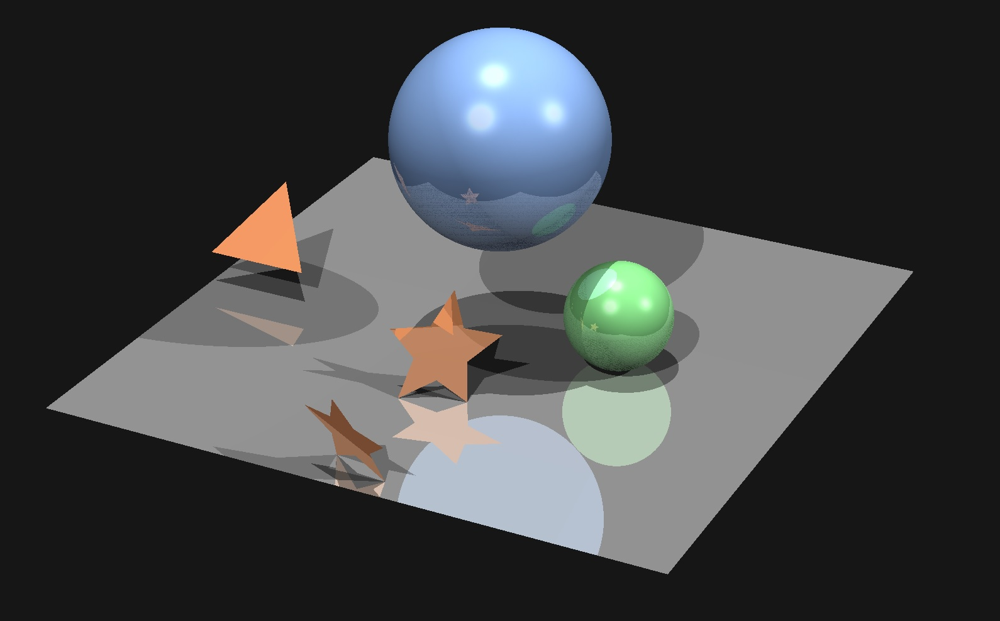

## At a Glance

A simple ray tracing based software renderer at children's play level, created for learning purpose.



## Features

- Written in C++, applying C with class diagram.
- Fully portable except the OS-related GUI parts.
- Based on ray-object Intersecting test.
- Lighting & Shadow
- ...

## Build & Run

### Requirements

- Windows
- MinGW or MSVC (Visual Studio 2017)
- CMake
- Catch (a unit testing framework)

### For MinGW

```shell
mkdir build-mingw
cd build-mingw
cmake .. -G "MinGW Makefiles"
mingw32-make -j 4
start app
```

### For MSVC

```shell
mkdir build-msvc
cd build-msvc
cmake .. -G "Visual Studio 15 2017"
start app.sln
```


